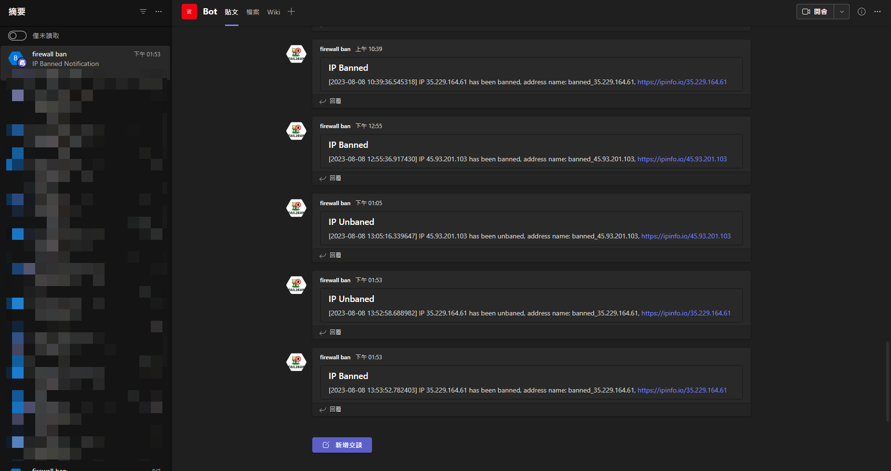
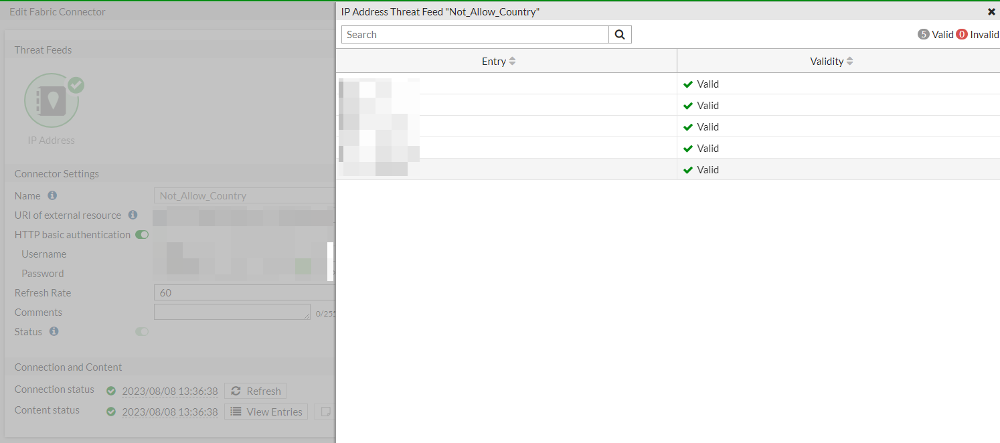
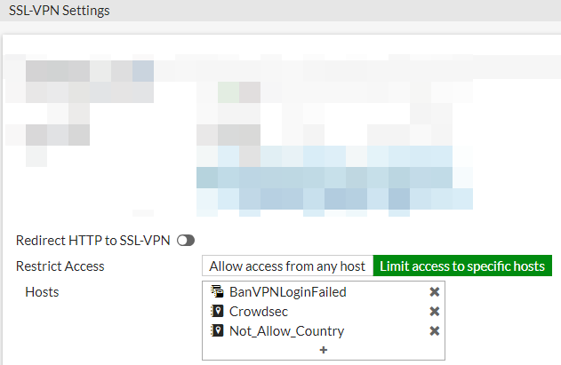

Teams Notification
[](example_pic/teams_notification.png)

## 核心思路
1. Fortigate Syslog 輸出至 Fail2ban server
2. Fail2ban 根據 Syslog 行為封鎖與解封 IP，並發送通知到 Teams
3. 封鎖 IP 規則有兩個分支，具體參照 fail2bandata/jail.d/jail.local

### 台灣美國IP
- jail.local 中 [general-forceful-browsing] 區塊
- 1天內登入失敗5次 > 加入 fail2ban 資料庫 > 透過 API 加到 fortigate 封鎖清單
- 時間到 API fortigate 解封
- 存在 fail2ban 資料庫的 IP 在365天內，每登入失敗5次，封鎖時間依次遞增，最長365天

### 非台灣美國IP
- jail.local 中 [bancountry] 區塊
- 登入失敗1次 > 加入 fail2ban 資料庫 > 透過 API 加到 fortigate 封鎖清單 + 加入 not_allow_country 清單
- 時間到 API fortigat 解封
- fortigate 載入 not_allow_country 清單
- 每天檢查 not_allow_country 清單，如果有包含台灣美國 IP 則刪除

## How to use
### 前置條件
1. 已安裝 docker & docker compose
2. 已安裝 Python3 & pip
3. fail2ban server 已有一套接收 Syslog 的機制，例如 rsyslog
4. Fortigate Syslog 輸出到 fail2ban server /var/log/fortinet/syslog.log 底下
5. 修改 fail2bandata/action.d/example.env 檔案並另存為 .env，```TEAMS_WEBHOOK_URL```如果不需要使用Teams通知可以不用填

### 使用流程
- 啟用
```
# 修改 fail2bandata/action.d/example.env 檔案並另存為 .env
git clone https://github.com/ValorVie/Fail2banFotigate.git
chmod +x ./Fail2banFotigate/geoip/updategeoip.sh
./Fail2banFotigate/geoip/updategeoip.sh
cd Fail2banFotigate
docker-compose up -d
```

- 設定GeoIP數據庫定期更新 & 定期檢查 not_allow_country 清單
```
crontab -e
0 21 * * * /PATH/Fail2banFotigate/geoip/updategeoip.sh
0 22 * * * /usr/bin/python3 /PATH/Fail2banFotigate/geoip/checkip.py
```

- Fortigate 阻擋列表引入外部連結 not_allow_country.log 清單 (internal web server or public service)
[](example_pic/allowed_countries.png)

- Fortigate VPN Portal Setting
[](example_pic/vpn_portal_setting.png)


## 文件說明
### 基本設定
1. fail2bandata/jail.d/jail.local 處理封鎖規則，bandtime、findtime，跟時間等等
2. fail2bandata/filter.d/general-forceful-browsing.conf fail2ban 的 filter，過濾 Syslog 符合正規表達式的 log 才觸發
3. fail2bandata/action.d/ 主要文件為 action-ban-forceful-browsing.conf 以及 action-bancountry.conf，主要控制符合封鎖規則時應觸發的程式

### 執行設定
fail2bandata/action.d/ 底下
- ban.py # 觸發封鎖條件的 IP 透過 fortigate API 加入 address list & BanVPNLoginFailed group
- unban.py # 封鎖時間結束後 透過 fortigate API 刪除 address list & BanVPNLoginFailed group 中的解封 IP
```
# 如果不用 Teams 以下區塊可以註解掉
        teams_message = {
            "@type": "MessageCard",
            "@context": "http://schema.org/extensions",
            "summary": "IP Unbaned Notification",
            "title": "IP Unbaned",
            "text": f"[{now}] IP {ip} has been unbaned, address name: {ban_ip_address['name']},  https://ipinfo.io/{ip}",
        }
        requests.post(teams_webhook_url, json=teams_message, verify=False)
```
- countryban.py # 判斷觸發封鎖條件的 IP 來源國家，若在允許清單 allowed_countries.txt 中則返回 true，若不在允許清單 allowed_countries.txt 中則返回 false 並將 IP 寫入 not_allow_country.log


### 其他文件
geoip 底下
- allowed_countries.txt # 允許的國家清單
- not_allow_country.log # 觸發封鎖條件後且不在允許國家清單內的 IP 紀錄
- updategeoip.sh # 更新 geoip 數據庫腳本
- checkip.py # 檢查 not_allow_country.log 中的 IP 國家

## Reference
crazy-max/docker-fail2ban: Fail2ban Docker image  
https://github.com/crazy-max/docker-fail2ban

Solved: Fortigate API - Remove address from group address - Fortinet Community  
https://community.fortinet.com/t5/Support-Forum/Fortigate-API-Remove-address-from-group-address/td-p/210349

REST API administrator | FortiGate / FortiOS 6.4.12  
https://docs.fortinet.com/document/fortigate/6.4.12/administration-guide/399023

Fortigate API Automation Using Python: API Token based and session-based authentication Postman - YouTube  
https://www.youtube.com/watch?v=Avw2-0wVDlI&t=1194s

Technical Tip: How to block SSL-VPN Connection fro... - Fortinet Community  
https://community.fortinet.com/t5/FortiGate/Technical-Tip-How-to-block-SSL-VPN-Connection-from-a-certain/ta-p/206883

Technical Tip: How to limit SSL VPN login attempts... - Fortinet Community  
https://community.fortinet.com/t5/FortiGate/Technical-Tip-How-to-limit-SSL-VPN-login-attempts-and-block/ta-p/194229

Variable interpolation appears to be broken for actioncheck · Issue #1907 · fail2ban/fail2ban  
https://github.com/fail2ban/fail2ban/issues/1907